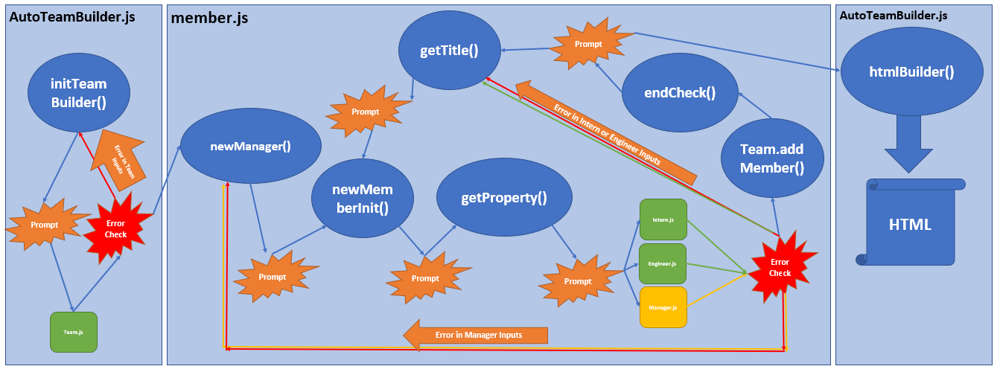

# Auto-Team-HTML-Builder
A tool that will auto-generate HTML for your development team!

## User Experience
### Node.js

[Node.js](https://nodejs.org/en/) is a tool that allows JavaScript to be utilized in the terminal in this project as well as the npm modules to expand that usage. Ensure Node.js is installed prior to using this tool. 

Then, pull this repo onto your local PC, navigate to the folder, then send "npm i" to install all the required libraries as set by the associated package.json file. Then run the tool by sending "node AutoTeamBuilder.js" into your terminal. The tool will walk you through a series of prompts:
* Team Name and Information
* Manager Name and Information
* Additional Team Members & Associated info based on the selected title
* Continue Adding Team Members
* Finalize and Create HTML

### HTML Output
An HTML file, named by the input Team Name, will be saved in the "Output" folder. The HTML will be formatted using Bootstrap CDN.

* Expanded Window Size

* Narrow Window Size. Note the drop-down menu appears for the external links.

## How it Works
### Function Pathway

The tool prompts for all info for each CLASS before actually sending the info to the constructor.

### Classes

Classes are used to help put together 

* Team: this is the "parent" class which holds the team info and an array containing each team member, including the manager.

The following classes are all almost identical, except each has its own unique title and title property. These classes also provide the HTML to the HTML builder, each containing unique formatting therein:
* Manager: this is the only required team member and is only prompted for once. The manager's unique property is Office Number. 
* Engineer: this team member requires a github profile link as its unique property. There is no limit of Engineers for the team.
* Intern: this team member rquires a school name as its unique property. There is no limit of Interns for the team.

Each class has "input checks" that send back a blank object if any of the required inputs are blank or fail on the formatting of those inputs.

## Tools Used
### Inquirer

[Inquirer](https://www.npmjs.com/package/inquirer?activeTab=readme) is used to prompt for inputs from the user. The input responses are used in the class constructors. On the prompts that finalize and create a new class a conditional is used to either create the appropriate class and detect if the constructor returns a blank object. 

### fs

fs, or ["file system"](https://www.npmjs.com/package/fs), is used to create the HTML file. It is provided with Node.js and does not require installation.

### Bootstrap

[Bootstrap CDN](https://getbootstrap.com/) is used to format the HTML page. Bootstrap tags are set in the class constructors and htmlBuilder.js.

## Testing
### Jest

[Jest](https://jestjs.io/docs/en/getting-started) is a node tool that allows testing of class constructors (and more). In this project, because the class constructors each have unique requirements for each input, Jest allows those requirements to be tested. The testing creates the new class based on specified "test" info, bypassing Inquirer, and checks it against an Expected output. When the test fails Jest makes it clear what failed. For each class there is an associated .test.js file to go along 

This project has been tested and all tests pass!

## Credits

**Author:** Erik Portillo
**Date:** January 28, 2021
**School:** University of Oregon
**Program:** Coding Bootcamp